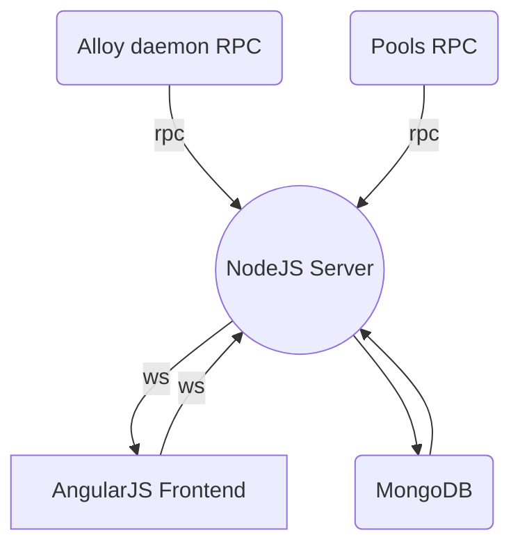

Alloy Block Explorer
============

This is a Cryptonote **Block Explorer** designed for tracking [**Alloy [XAO]**](https://alloy.cash) network status.

It gathers data from the `Alloy daemon` and `compatible pools` via `rpc`, processes everything, saves to `MongoDB` and uses `WebSockets` to send stats over to a nice `AngularJS` interface.


## Screenshots


## Prerequisites
* NodeJS 8.6.0
* npm 5.4.2
* Mongodb 3.4.4
* grunt

## Installation
> **Important:** Make sure you have the prerequisites installed.

```bash
git clone https://github.com/kh4n-ro/Alloy-Block-Explorer
cd Alloy-Block-Explorer
npm update
npm install
sudo npm install -g grunt-cli
```

To build run
```bash
grunt build
```

## Config
> This example config file is located under `lib/config-example.js`
> After entering your own data, save the file under `lib/config.js`
```bash
module.exports = {
  "NAME": "Alloy  Explorer",
  "ADMIN": {
    "USERNAME": "ADMIN_USERNAME",
    "PASSWORD": "ADMIN_SECURE_PASSWORD",
    "SECRET": "SOME_SECRET_STRING"
  },
  "EMAIL": "YOUR_EMAIL",
  "DB": {
    "HOST": 'localhost',
    "DBNAME": 'DB_NAME',
    "RETRIES": 50
  },
  "FRONTEND": {
    "HOSTNAME": 'alloyexplorer.com',
    "HOST": '0.0.0.0',
    "PORT": 3000,
    'TOKEN_EXPIRATION': 60 * 20
  },
  "DAEMON": "DAEMON_RPC_URL",
  "BLOCKTARGETINTERVAL" : 180,
  "COINUNITS" : Math.pow(10, 12),
  "SYMBOL" : "XAO",
  "POOLS":[{
    "frontend": "alloypool.com",
    "api": "https://alloypool.com/api/stats"
  },{
    "frontend": "POOL_HOST",
    "api": "POOL_STATS_API"
  }],
  "VERBOSITY": 2
}
```
## Run
```bash
npm start
```

Keep in mind that this app is still in its `early Alpha` stage of development.
Still many features to be added.
